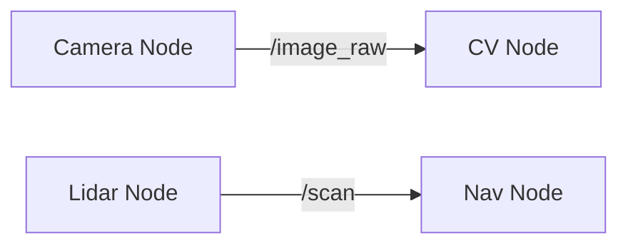

# Chapter 4: ROS 2 Fundamentals

**ROS 2 (Robot Operating System 2)** is not an actual operating system (like Windows or Linux); it is a **middleware**—a set of software libraries and tools that help you build robot applications.

## The Graph Architecture

ROS 2 systems consist of a network of processes called **Nodes**.

*   **Node:** A single executable that performs a specific task (e.g., read camera, control wheels).
*   **Graph:** The network of connected nodes.

## Communication Patterns

### 1. Topics (Publish / Subscribe)
Used for continuous data streams (sensor data, robot state).
*   **Publisher:** Sends data ("I see an obstacle").
*   **Subscriber:** Receives data ("Oh, there's an obstacle").
*   **Relationship:** Many-to-Many.

### 2. Services (Request / Response)
Used for quick transactions.
*   **Client:** Asks for something ("Spawn a robot").
*   **Server:** Does the work and replies ("Done").
*   **Relationship:** One-to-One.

### 3. Actions (Goal / Feedback / Result)
Used for long-running tasks.
*   **Goal:** "Go to the kitchen."
*   **Feedback:** "I am 50% there... 60% there..."
*   **Result:** "I arrived."

## DDS (Data Distribution Service)

Unlike ROS 1, which used a custom TCP/UDP protocol, ROS 2 uses **DDS**, an industry-standard for real-time systems.
*   **Discovery:** Nodes automatically find each other on the network.
*   **QoS (Quality of Service):** You can configure reliability.
    *   *Reliable:* Guaranteed delivery (like TCP).
    *   *Best Effort:* Fast, but might lose packets (like UDP) - good for video.

## Key CLI Commands

| Command | Description |
| :--- | :--- |
| `ros2 node list` | Show all running nodes |
| `ros2 topic list` | Show all active topics |
| `ros2 topic echo /topic` | Print data from a topic |
| `ros2 run <pkg> <exec>` | Run a specific node |
